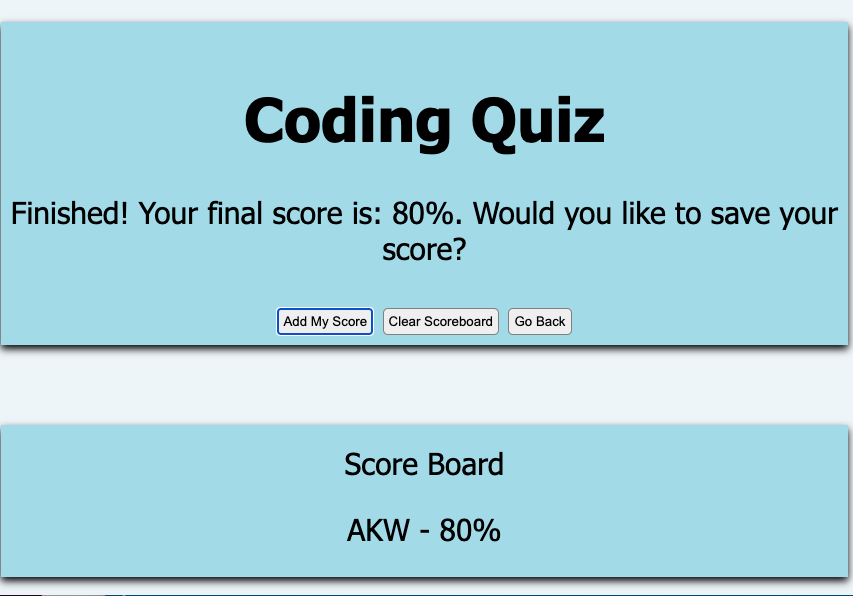

# 04 Web APIs: Code Quiz

## Application Overview

For this application, I built a timed coding quiz with multiple-choice questions. This app runs in the browser and features dynamically updated HTML and CSS powered by JavaScript code. 

## User Story

```
AS A coding boot camp student
I WANT to take a timed quiz on JavaScript fundamentals that stores high scores
SO THAT I can gauge my progress compared to my peers
```

## Acceptance Criteria

```
GIVEN I am taking a code quiz
WHEN I click the start button
THEN a timer starts and I am presented with a question
WHEN I answer a question
THEN I am presented with another question
WHEN I answer a question incorrectly
THEN time is subtracted from the clock
WHEN all questions are answered or the timer reaches 0
THEN the game is over
WHEN the game is over
THEN I can save my initials and my score
```

## Developer Notes
The application functions by showing a quiz and allowing a user to go through against a timer in the top left. The user can add their initials at the end, clear the scoreboard, or go back to start. If the user runs out of time, the quiz will jump to the end page. 

## Mock-Up

The following screenshots demonstrate the application start and end pages:

 



## Link to Live Site
https://awhite927k.github.io/codingquiz/

## Contact Information
awhite214@gmail.com